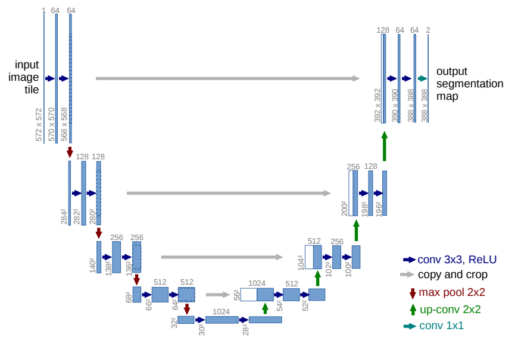
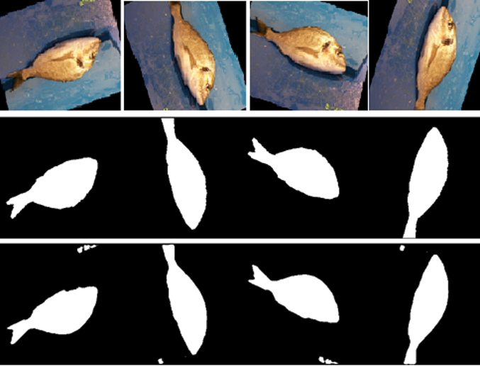

#  U-Net based Binary Semantic Image Segmentation

Binary semantic segmentation is a computer vision task that classifies every pixel in an image into one of two categories: the object of interest as foreground category and everything else as a background category, effectively creating a binary mask. It's a specific type of semantic segmentation, crucial for tasks like medical image analysis (e.g., segmenting tumors) or satellite imagery (e.g., separating land from water).

- Here, we have trained a deep learning based U-Net model for binary semantic segmentation of fish present in an Image. We have treated fish in the Image as the foreground class and the rest as background.

- We have used subset of images from [A Large Scale Fish Dataset](https://www.kaggle.com/datasets/crowww/a-large-scale-fish-dataset) for training and validation purposes.

Network:
------- 
  
Fig. 1. The schematic representation of the U-Net design. The Image source is taken from [U-Net: Convolutional Networks for Biomedical Image Segmentation](https://link.springer.com/chapter/10.1007/978-3-319-24574-4_28).

Results:
-------- 
Quantitative result:

| Pixel Accuracy (%)  | Diece Coefficient (%)  |
|---------------------|------------------------| 
|        97.13        |       93.59            |

   
  Fig. 2. Plot for training loss.

   
  Fig. 3. Plot for validation pixel accuracy.

   
  Fig. 4. Plot for validation dice coefficient.

<figure style="margin:0">
  
  <figcaption style="text-align:center;">Fig. 5. Qualitative sample prediction results on the validation dataset. The first, second & third rows in the figure represents the input images, ground truths & the prediction results respectively.</figcaption>
</figure>
